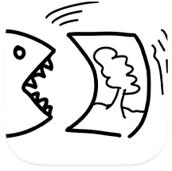

# PPMGobbler

Simple image parser and encoder for PBM, PGM and PPM files, ASCII and binary variants are supported, bringing the full P1, P2, P3, P4, P5 and P6 support!

## Usage examples

```swift
let imageData = try Data(contentsOf: URL(fileURLWithPath: "/path/to/my/image"))

// read RGB image
let ppmImage = try PPMImage<PPMPixelRGB>(data: imageData)

// read Grey levels image
let pgmImage = try PPMImage<PPMPixelGrey>(data: imageData)

// read BW image
let pbmImage = try PPMImage<PPMPixelBW>(data: imageData)

// Access pixels
let firstPixelRedValue = ppmImage[0, 0].r

// Display (UIImage and NSImage support is available)
myUIImageView.image = ppmImage.uiImage
myNSImageView.image = ppmImage.nsImage

// Convert to another file format
let pngData = image.uiImage?.pngData()
```
